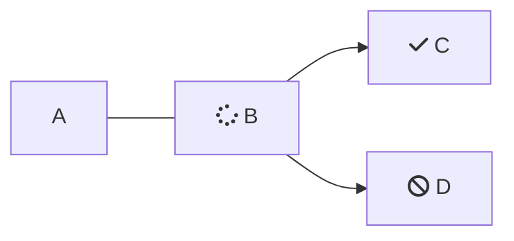

Lightcast Profile Analytics is built from individual profiles representing more than 331 million workers worldwide. Profiles typically include a person’s location, work history, education, and skills. Some profiles also contain contact details such as names, phone numbers, and email addresses, but these are never provided in bulk to Lightcast users.

Profile data offers detailed insights into worker skills, career pathways, alumni outcomes, company workforce characteristics, and more.

## Data Sources

Because of confidentiality and licensing requirements, Lightcast cannot publish a detailed list of profile sources. The most common sources include publicly available professional networking sites and other online data where individuals share career information.

## How Profiles Are Processed

<br />

```mermaid
flowchart LR 
 Standardization ---> Profile[Profile Matching] 
 Profile Matching --> Merging[Field Merging]
 Field Merging --> Normalization[Normalization]
 Normalization --> Location[Geographic Location]
 Geographic Location --> Experience[Job History]
 Job History --> Education[Education History]
 Education History --> Skills[Skills]
 Skills --> Profiles[Filtered Profiles]
 

 style ReadMe fill:#f9f,stroke:#333,stroke-width:4px
 style Mermaid fill:#bbf,stroke:#333,stroke-width:2px

```

<br />



### Standardization

All incoming profile data is converted into a consistent format. This step makes matching and analysis possible and ensures fields missing from one source don’t conflict with fields from another.

### Profile Matching

Lightcast receives profiles from many different sources. To determine whether two profiles belong to the same person, we use combinations of strongly identifying fields such as

* Name + email
* Name + phone number
* Online profile URLs

Matched profiles are grouped into a single person record. The matching process prioritizes accuracy over catching every duplicate.

### Field Merging

Once a person’s profiles are grouped, Lightcast merges their data elements such as jobs, education entries, or locations into a single, complete profile. Custom similarity checks help identify and remove duplicates within the group, so each field appears only once.

### Normalization

Normalization converts free-form text into consistent categories for easier aggregation. For example,

* Converting variations of “Saint Louis Missouri,” “ST Louis MO,” and “St. Louis Missouri” into “St. Louis, MO”
* Mapping company names to Lightcast's company taxonomy
* Mapping schools to Lightcast database of more than 20,000 institutions

Without normalization, searching and aggregating profile data would be unreliable.

### Geographic Location

Lightcast uses Google Geocoding to standardize profile locations to city, state or province, and county.

### Job History

* **Company**: Standardized to our company database, which includes industry information.
* **Job Title**: Mapped to Lightcast Job Titles taxonomy.
* **Occupation (O*NET/SOC)**: Assigned using job titles and job description text.

If a person lists multiple past roles, each job history entry is normalized and included. For U.S. and Canada profiles, users can apply the Profile Recency filter to view profiles updated within a specific timeframe.

### Education History

* **School**: Mapped to Lightcast database of postsecondary institutions, including campuses and sub-schools.
* **Degree Level**: Converted from free text to standard levels (associate, bachelor, master, doctorate/professional).
* **Field of Degree (CIP)**: Mapped to CIP 2010 codes when possible.

> Not all degrees map cleanly to CIP codes. Broader selections may be needed in some cases.

### Skills

Lightcast maintains a library of more than 34,000 skills. A context-aware tool extracts skills from profile text, including synonyms and variations.

> You can explore our Skills Taxonomy here   ----- Cross Link TBD

### Filtered Profile Set

After all processing, we remove profiles that cannot be reliably used. Profiles are excluded if

* The nation of residence is unknown
* No work history is available
* The profile is older than January 1, 2018
* The primary language is not English or Spanish

This ensures consistency and improves data quality across all products. For Alumni Outcomes and GoRecruit, Lightcast matches institutional data to this filtered and normalized profile dataset.
